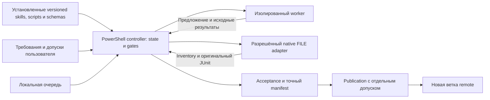
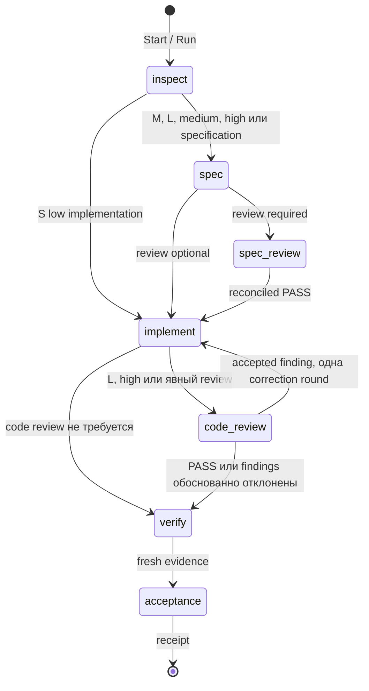

# Архитектура managed-контура BSL Flow

Статус документа: актуальная архитектура `0.8.0-dev.4`. Узкий native FILE-адаптер расширения прошёл публичный controller-owned unit-пилот с пятью тестами и контрольным восстановлением; это не подтверждает произвольные 1С, UI, EPF/ERF или production-сценарии. Временное ограничение Unica сохраняется. Историческое ADR-6 уточнено текущим статусом ниже. Актуальные решения и история — в [CHANGELOG.md](../CHANGELOG.md).

Машинные схемы и request/recovery contracts описаны в [`1c-task/references/task-contract.md`](../global/skills/1c-task/references/task-contract.md). Проверенная граница Windows host вынесена в [`managed-host-contract.md`](managed-host-contract.md).

## Контекст и цель

В 0.8 авторитетный engine и единственная машина состояний реализованы на PowerShell 7. Версионируемые skills, controller scripts и схемы поставляются одним проверяемым package bundle; пользовательский вход `Invoke-BSLFlowTask.ps1` запускается фиксированным системным `C:\Program Files\PowerShell\7\pwsh.exe`. Enforcement обеспечивают controller gates, hash-bound evidence и права worker. После rollback `native-cross-platform-cli` проект не выпускает собственный бинарник и не заявляет поддержку Linux/macOS.

Для явно разрешённого source repair controller различает завершённую неверную проверку и неопределённый результат. Диагностика читает исходную ошибку, а исправление обязательно получает свежие code review и verify. Тестовые файлы, выбранные trusted operator, заморожены по manifest; модель не может заменить проверку генерацией зелёного отчёта. Локальные runner и source handoff переиспользуют этот же controller и receipt, не создают альтернативные transitions или publication authority.

## Архитектурная граница Core/Managed

Core — assisted-контур по умолчанию. Он состоит из независимых skills `1c-init-project`, `1c-spec`, `1c-spec-review`, `1c-implement`, `1c-verify` и `1c-debug`; их последовательность остаётся под управлением пользователя и текущего агента. `1c-estimate` является отдельной opt-in операцией.

Managed начинается только для конкретной задачи после явного запроса пользователя и вызова `1c-task`. С этого момента controller владеет переходами, журналом, recovery и acceptance gates этой задачи. Установка managed-файлов, bootstrap проекта, `bsl-flow.yaml` и sentinel `.bsl-flow/project.yaml` лишь делают контракт доступным; они не активируют Managed и не подтверждают host/runtime readiness.

Repository registry, execution contract, publication, оценка и self-learning Experience Ledger не образуют скрытый второй workflow. Реестр и публикация вызываются отдельными командами, execution contract учитывается только при наличии артефактов, оценка запускается отдельным skill, а Experience Ledger требует проектного opt-in `features.self_learning_memory.enabled: true`. При выключенной памяти controller не читает и не изменяет ledger, но его обязательный task journal и resume-state продолжают работать. Acceptance не означает merge, push или deploy, а разрешение одного runtime target не распространяется на другие цели или задачи.

Assisted workflow хорошо работает, пока основной агент удерживает порядок этапов в диалоге. При длинной задаче или прерывании нужны durable identity, точное восстановление и проверяемый ответ на вопрос: относится ли этот PASS к текущим требованиям, policy, спецификации, исходникам и тестам.

Managed controller решает эту задачу как небольшой последовательный state machine. Он выбирает маршрут, сохраняет attempt до dispatch, запускает ограниченный worker, проверяет его результат и только сам создаёт acceptance receipt. Skills дают предметные инструкции этапам, OpenSpec хранит спецификацию, а deterministic gates принимают решение по проверяемым артефактам.

Для первой реализации сохранён существующий PowerShell 7 стек и добавлен отдельный `1c-task`. Усиление одних prompt-инструкций не обеспечило бы запрет переходов и восстановление после сбоя. Превращение OpenSpec в оркестратор смешало бы спецификацию с исполняемым состоянием. Отдельный сервис, база данных и распределённый workflow engine потребовали бы новой установки и эксплуатации, тогда как подтверждённый сценарий — последовательная локальная задача. Поэтому эти варианты не входят в текущую поставку; существующие skills и OpenSpec переиспользуются.

Упаковка использует стандартный .NET ZipArchive и PowerShell 7. Воспроизводимость ограничена одной PowerShell/.NET toolchain; стандартный путь runtime — `C:\Program Files\PowerShell\7\pwsh.exe`, без fallback на PS5. Исторические PS5-результаты не являются текущим PASS. Собственный ZIP encoder добавил бы лишний код формата и CRC.

## Граница доверия

Controller и установленные skills считаются trusted operator code. Авторитетный state и пользовательские input events находятся в основном project root. Worker получает отдельную detached worktree: read-only этапы читают её, `implement` может менять исходники только там. Worker не может менять controller state, выдавать себе authorization, устанавливать инструменты, публиковать результат или работать с базой 1С.

Ограничение относится и к дочерним процессам тестов. Source-controlled test script, Git hook, filter, config или другой executable нельзя считать безопасным только потому, что его вызвал controller. Source-only test executable запускается через тот же sandbox profile; project Codex execution config блокируется. Платформа 1С запускается отдельным controller-owned native адаптером после проверки точного target, snapshot и допуска; она не исполняется внутри worker sandbox. Прямая команда человека, внешний terminal и процесс вне этого контура остаются вне enforcement boundary.

Worker result — предложение этапа по JSON Schema. Даже `status: completed` не является acceptance. Авторитетный результат появляется после записи terminal attempt, проверки hashes и прохождения всех gates.

## ADR-1: файловый последовательный журнал и один writer

**Решение.** Каждая задача хранит immutable revisions в `.bsl-flow/tasks/<uuid>/revisions`. Ревизия содержит номер и SHA-256 предыдущей. OS file lock допускает одного writer; optimistic `expected_revision` защищает обновления пользователя. `current.json` — производный указатель.

**Почему.** Такой журнал работает в PowerShell 7 без отдельной БД, легко переносится с проектом и позволяет восстановить состояние после обрыва записи. Исторические проверки PS5 сохранены для provenance и не определяют текущую поддержку. Attempt сохраняется до запуска процесса, поэтому recovery знает его identity.

**Цена.** Controller сериализует переходы одной задачи. Файловый lock не координирует произвольные внешние действия и не даёт распределённого consensus. Повреждение или разрыв hash chain переводит чтение в `BLOCKED`; `current.json` не используется как источник истины.

## ADR-2: hash dependencies вместо одной revision

**Решение.** Evidence связывается с хешами только тех данных, от которых зависит этап: intent, policy, baseline/classification, spec, criteria, correction round и source manifest. Перед dispatch, при записи terminal result и при acceptance зависимости вычисляются заново.

**Почему.** Один общий revision сделал бы любое независимое событие причиной полного rerun либо позволил бы случайно принять старый PASS. Dependency hashes точнее показывают, какой gate устарел. Authorization-only update может сохранить intent hash и ещё применимый spec review; изменение требований инвалидирует зависимые этапы.

**Цена.** Матрица зависимостей становится частью критического кода. Пропущенная зависимость опаснее лишнего rerun, поэтому acceptance дополнительно проверяет текущую policy, raw hashes и полный source manifest.

## ADR-3: полный manifest worktree, несмотря на source hints

**Решение.** `source_paths` используется как discovery hint, но manifest перечисляет весь worker checkout: каждый файл и SHA-256, untracked-файлы и удаления baseline. `.git`, `.bsl-flow` и `.bsl-flow-worker` исключены как административные/generated paths.

**Почему.** Worker с write-доступом к worktree способен изменить файл вне подсказанного каталога. Частичный manifest позволил бы такому изменению не инвалидировать review или verify.

**Цена.** Полное сканирование дороже на больших репозиториях. Ревизия Git сама по себе недостаточна, потому что worker остаётся на baseline HEAD, а полезные изменения, untracked-файлы и удаления находятся в рабочем дереве.

## ADR-4: review только критикует, reconciler принимает решения

**Решение.** Независимый reviewer читает полный актуальный diff, спецификацию и исходный запрос, не редактирует файлы и возвращает `PASS`, `REVISE` или `BLOCK` с адресуемыми findings. Отдельный reconciler принимает или отклоняет каждый finding с evidence. Принятое замечание вызывает одну correction round и новый независимый review полного изменённого diff.

Для спецификаций применяется фиксированный cost/risk tier: S по умолчанию проходит только deterministic lint, M — одного sealed reviewer, L или high-risk — API Council с председателем и независимыми критиками. Явно запрошенный review для S использует одного reviewer. Включённый Council не повышает M автоматически, а недоступный Council для L/high-risk даёт `BLOCKED`, не downgrade.

**Почему.** Reviewer не получает право автоматически расширить scope или переписать реализацию. Reconciliation сохраняет ответственность основного инженерного контура и отличает реальный дефект от пожелания. Spec review аналогично завершается lint и final validation актуальной reconciled specification.

**Цена.** Появляется дополнительный model call и конечный лимит correction rounds. Незакрытое замечание или неполная reconciliation блокирует acceptance; текст автора `addressed` не заменяет свежий review.

## ADR-5: неизвестный эффект требует control read

**Решение.** Timeout, cancel или отсутствие terminal receipt после потенциально изменяющего этапа помечает эффект как unknown. Controller сохраняет raw output и запрещает новый dispatch. Resume регистрирует готовый terminal result, если он уже есть; иначе оператор должен выполнить контрольное чтение фактического состояния. В source-only профиле recovery принимает точный attempt ID и свежий hash полного source manifest.

**Почему.** Повтор операции после сетевого/процессного сбоя может продублировать изменение, хотя receipt не успел сохраниться. Отсутствие receipt не доказывает отсутствие эффекта.

**Цена.** Часть сбоев требует ручной проверки. Cancel не является rollback. Для внешних и бизнес-операций нужен специфичный control-read контракт; общего безопасного auto retry нет.

## ADR-6: первоначальный запрет неподтверждённого runtime (история 0.7)

**Решение в 0.7.** Criteria типов `integration`, `ui` и `external_artifact` сохранялись как обязательные и требовали точную target identity. Source-only controller не запускал их и возвращал `BLOCKED`. Нельзя было переименовать runtime-проверку в `static` или заменить её file assertion.

**Почему.** Подготовленный тест, локальный sentinel или успешная сборка не доказывает загрузку, UI-поведение либо бизнес-результат в конкретной базе. На этапе 0.7 managed-адаптер ещё не был реализован; отдельный native-пилот в `bp1` не входил в публичный controller и не закрывал его runtime gate. Временное ограничение durable Unica jobs сохраняется.

**Текущий статус.** Начиная с `0.8.0-dev.2` controller поддерживает только узкий явно разрешённый native-маршрут: FILE-база, одно расширение, точный snapshot и объявленные YAxUnit-тесты с оригинальным JUnit и control-read recovery. Все остальные runtime, UI, EPF/ERF и production-гейты остаются `BLOCKED` до появления отдельного подтверждённого адаптера и evidence contract.

## Поток задачи

Любой этап может перейти в `needs_input`, `blocked`, `failed` или `cancelled`. `Run` идёт последовательно до такого состояния либо acceptance. `Status` и `Next` только читают state. `Update` — единственный вход для clarification, authorization, scope change и recovery от trusted operator.

## Приёмка и наблюдаемость

Acceptance receipt связывает task ID, intent revision/hash, policy hash, baseline, полный source manifest и terminal result каждого обязательного gate. Его scope — `analysis` либо `source-and-declared-checks`; он не расширяет разрешения на внешние действия.

Raw evidence хранится в зарегистрированном attempt directory и само привязано хешами. Для static/unit проверки controller требует оригинальный JUnit, точный набор `expected_tests`, отсутствие failures/errors/skips/disabled и успешный exit test process. Изменённый или исчезнувший raw artifact делает evidence stale.

Codex adapter сохраняет session ID, requested model/effort и provider usage, если оно пришло в завершённом JSONL turn. Поля observed model/effort могут быть неизвестны. Без attributable usage стоимость остаётся неизвестной; ноль и оценка по имени модели не записываются как факт.

## Ограничения релиза

- обычный managed-адаптер принимает стабильный `codex-cli` начиная с `0.153.0` только после проверки фактической sandbox-изоляции; profiled-контур дополнительно связывает точные версии и SHA-256 provider/sandbox, а sealed fallback Council сохраняет отдельный проверенный контракт;
- source-only worker не получает сеть, plugins, multi-agent, memories, browser/computer use, hooks или project Codex config;
- задачи выполняются последовательно; task lock дополняется отдельными same-user locks для разрешённой FILE-базы и пары remote/ref;
- новый publication profile создаёт одну Git-ветку; merge, deployment, глобальная установка и автоматический rollback в него не входят;
- runtime ограничен явно разрешённым расширением в FILE-базе; UI и external artifact требуют своих подтверждённых adapters/evidence;
- фактическая приёмка версии ведётся отдельно от этой архитектурной страницы.

## ADR-7: native действия принадлежат controller

**Решение.** Фиксированный native-адаптер проверяет платформу и FILE identity, создаёт snapshot расширения, последовательно выполняет inventory/load/update/test/inventory и сохраняет оригинальный JUnit. В worker не передаются credentials или команды изменения базы. Приватный stdin заменяет доступные тому же пользователю credential-файлы; `/P` процесса 1С остаётся известным ограничением платформы.

**Почему.** Wrapper вне controller не связывал runtime с общей acceptance. Одних prompt-инструкций недостаточно для запрета повторного load после потери отчёта. Отдельный pending по физической базе сохраняется даже при новой task identity. Control-read recovery не создаёт тестовый PASS; test-only продолжение требует проверяемого доказательства ранее загруженного точного snapshot.

**Цена.** Unknown остаётся BLOCKED до проверки фактического состояния. Общий ledger относится к одному пользователю и не блокирует сторонние административные действия. Подробный [runtime-контракт](NATIVE_RUNTIME_RU.md) включает реальные результаты и ограничения.

## ADR-8: независимая оценка тестов перед исполнением

**Решение.** Trusted requirements связываются с критериями и конкретными защищёнными тестами. Даже S-задача с mapping проходит независимый code review, где отдельно оценивается достаточность проверок. `SUFFICIENT` разрешает verify; фактический PASS появляется только после исполнения и проверки исходного результата.

**Почему.** Формально зелёный тест может не наблюдать требуемое поведение. Executor не должен ослаблять проверку, чтобы исправление выглядело успешным. Отдельная state machine для coverage не нужна: сохранённый review, binding и существующие gates решают эту задачу.

**Цена.** Смысловая оценка модели не является математическим доказательством полноты тестов. Поэтому сохраняются исходные требования, объяснения reviewer, тестовые файлы и hashes. Подробности — [достаточность приёмки](REQUIREMENT_COVERAGE_RU.md).

## ADR-9: публикация отделена от acceptance

**Решение.** Publication получает собственный UUID и явный допуск на acceptance/remote/ref. Git plumbing формирует обычный commit с исходным baseline parent и точными accepted bytes. Новый branch создаётся только при отсутствии ref; intent и same-user pending сохраняются до отправки. После неизвестного результата допускается контрольное чтение, а не повторный push.

**Почему.** Общий `git add/commit/push` может применить filters, отправить лишние файлы или исполнить project config/hooks. Повтор команды после сетевой ошибки не доказывает отсутствие первой записи. Отдельный service или внешний workflow engine не нужны для последовательной локальной поставки.

**Цена.** Поддержанные transport/auth profiles узкие; CI, PR review, production rollout и rollback имеют самостоятельные критерии. Durable `published` фиксирует исторически доказанную отправку и позволяет завершить локальное снятие pending даже при последующей недоступности remote. Подробности — [контракт публикации](PUBLICATION_RU.md).

## ADR-10: архитектурный контекст является производной read-only проекцией

**Решение.** Решено ввести машинно-читаемый индекс ADR, компактный контекст возобновления и выборку применимых решений для этапа. Индекс ссылается на нормативный текст ADR и не копирует его. Проекции строятся из текущего controller state, trusted inputs, OpenSpec, policy, manifests и receipts; включают авторитетный `Get-BFNext`, имеют versioned schema и hashes входов. Они не создают transitions, authorization, acceptance или publication authority.

**Почему.** После паузы агенту нужен короткий проверяемый контекст: состояние задачи, применимые решения, зависимости, отсутствующие данные и следующий разрешённый шаг. Повторное чтение всей документации дорого и склонно к пропуску ограничений, но отдельный архитектурный store или второй state machine разошлись бы с controller. Производная проекция сокращает discovery, сохраняя единственный источник истины.

**Цена.** Индекс и subject mapping становятся частью package contract и требуют validation. Изменение применимого ADR инвалидирует связанный stage bundle; отсутствующая ссылка даёт `missing_context`, а повреждённая — fail-closed, а не молчаливый fallback. Проект может добавить собственный `docs/architecture/adr-index.json` как необязательный project-owned файл: bootstrap его не создаёт, не перезаписывает и не считает managed, а его отсутствие сохраняет прежний fallback. Подробности — [справка bootstrap](../global/skills/1c-init-project/references/architecture-context.md).
