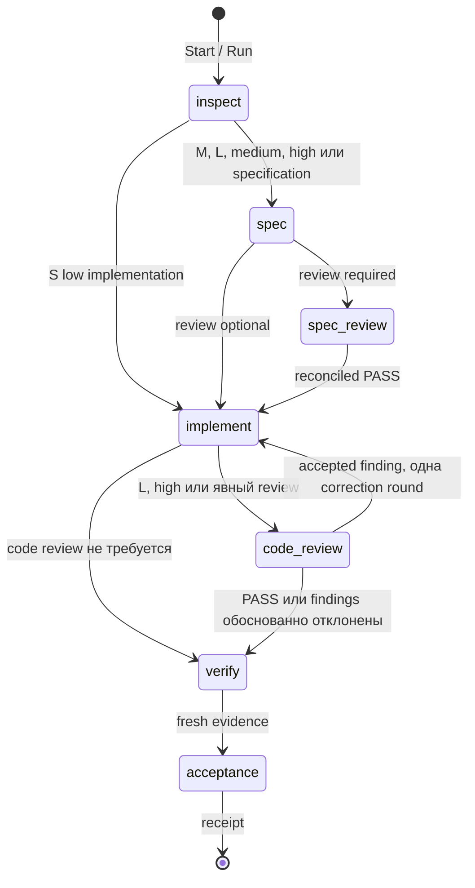

# Архитектура managed-контура BSL Flow

Статус документа: сохранённые решения source-only ядра `0.7.0-dev.1` и расширения `0.8.0-dev.1`. Managed-адаптер 1С runtime ещё не подтверждён и отключён; также сохраняется временное ограничение Unica. Документ не утверждает завершение M8 или полную автономность. Текущие результаты приведены в [отчёте проверки](../VERIFICATION.md), дальнейшие gates — в [плане 0.8](PLAN_0.8_RU.md).

Машинные схемы и request/recovery contracts описаны в [`1c-task/references/task-contract.md`](../global/skills/1c-task/references/task-contract.md). Проверенная граница Windows host вынесена в [`managed-host-contract.md`](managed-host-contract.md).

## Контекст и цель

В 0.8 собственный Go CLI содержит версионируемые инструкции и PowerShell engine. Он проверяет полный embedded bundle, безопасно публикует его в cache и передаёт закрытые команды фиксированному системному PowerShell. Машина состояний остаётся одной. Бинарник улучшает запуск и поставку; enforcement обеспечивают controller gates и права worker. Полный перенос engine на Go отложен до измеренного ограничения текущего исполнения.

Для явно разрешённого source repair controller различает завершённую неверную проверку и неопределённый результат. Диагностика читает исходную ошибку, а исправление обязательно получает свежие code review и verify. Тестовые файлы, выбранные trusted operator, заморожены по manifest; модель не может заменить проверку генерацией зелёного отчёта. Локальные runner и source handoff переиспользуют этот же controller и receipt, не создают альтернативные transitions или publication authority.

Assisted workflow хорошо работает, пока основной агент удерживает порядок этапов в диалоге. При длинной задаче или прерывании нужны durable identity, точное восстановление и проверяемый ответ на вопрос: относится ли этот PASS к текущим требованиям, policy, спецификации, исходникам и тестам.

Managed controller решает эту задачу как небольшой последовательный state machine. Он выбирает маршрут, сохраняет attempt до dispatch, запускает ограниченный worker, проверяет его результат и только сам создаёт acceptance receipt. Skills дают предметные инструкции этапам, OpenSpec хранит спецификацию, а deterministic gates принимают решение по проверяемым артефактам.

Для первой реализации сохранён существующий стек PowerShell 5.1/7 и добавлен отдельный `1c-task`. Усиление одних prompt-инструкций не обеспечило бы запрет переходов и восстановление после сбоя. Превращение OpenSpec в оркестратор смешало бы спецификацию с исполняемым состоянием. Отдельный сервис, база данных и распределённый workflow engine потребовали бы новой установки и эксплуатации, тогда как подтверждённый сценарий — последовательная локальная задача. Поэтому эти варианты не входят в текущую поставку; существующие skills и OpenSpec переиспользуются.

Упаковка использует стандартный .NET ZipArchive и PowerShell 7. Воспроизводимость ограничена одной PowerShell/.NET toolchain: PS5 .NET Framework и современный .NET создают разные байты для NoCompression. Собственный ZIP encoder добавил бы лишний код формата и CRC. Поэтому PS5 поддержан для установки и работы контроллера, а повторная сборка выполняется через `pwsh`.

## Граница доверия

Controller и установленные skills считаются trusted operator code. Авторитетный state и пользовательские input events находятся в основном project root. Worker получает отдельную detached worktree: read-only этапы читают её, `implement` может менять исходники только там. Worker не может менять controller state, выдавать себе authorization, устанавливать инструменты, публиковать результат или работать с базой 1С.

Ограничение относится и к дочерним процессам тестов. Source-controlled test script, Git hook, filter, config или другой executable нельзя считать безопасным только потому, что его вызвал controller. Native test executable запускается через тот же sandbox profile; project Codex execution config блокируется. Прямая команда человека, внешний terminal и процесс вне этого контура остаются вне enforcement boundary.

Worker result — предложение этапа по JSON Schema. Даже `status: completed` не является acceptance. Авторитетный результат появляется после записи terminal attempt, проверки hashes и прохождения всех gates.

## ADR-1: файловый последовательный журнал и один writer

**Решение.** Каждая задача хранит immutable revisions в `.bsl-flow/tasks/<uuid>/revisions`. Ревизия содержит номер и SHA-256 предыдущей. OS file lock допускает одного writer; optimistic `expected_revision` защищает обновления пользователя. `current.json` — производный указатель.

**Почему.** Такой журнал работает в PowerShell 5.1/7 без отдельной БД, легко переносится с проектом и позволяет восстановить состояние после обрыва записи. Attempt сохраняется до запуска процесса, поэтому recovery знает его identity.

**Цена.** Controller сериализует переходы одной задачи. Файловый lock не координирует произвольные внешние действия и не даёт распределённого consensus. Повреждение или разрыв hash chain переводит чтение в `BLOCKED`; `current.json` не используется как источник истины.

## ADR-2: hash dependencies вместо одной revision

**Решение.** Evidence связывается с хешами только тех данных, от которых зависит этап: intent, policy, baseline/classification, spec, criteria, correction round и source manifest. Перед dispatch, при записи terminal result и при acceptance зависимости вычисляются заново.

**Почему.** Один общий revision сделал бы любое независимое событие причиной полного rerun либо позволил бы случайно принять старый PASS. Dependency hashes точнее показывают, какой gate устарел. Authorization-only update может сохранить intent hash и ещё применимый spec review; изменение требований инвалидирует зависимые этапы.

**Цена.** Матрица зависимостей становится частью критического кода. Пропущенная зависимость опаснее лишнего rerun, поэтому acceptance дополнительно проверяет текущую policy, raw hashes и полный source manifest.

## ADR-3: полный manifest worktree, несмотря на source hints

**Решение.** `source_paths` используется как discovery hint, но manifest перечисляет весь worker checkout: каждый файл и SHA-256, untracked-файлы и удаления baseline. `.git`, `.bsl-flow` и `.bsl-flow-worker` исключены как административные/generated paths.

**Почему.** Worker с write-доступом к worktree способен изменить файл вне подсказанного каталога. Частичный manifest позволил бы такому изменению не инвалидировать review или verify.

**Цена.** Полное сканирование дороже на больших репозиториях. Ревизия Git сама по себе недостаточна, потому что worker остаётся на baseline HEAD, а полезные изменения, untracked-файлы и удаления находятся в рабочем дереве.

## ADR-4: review только критикует, reconciler принимает решения

**Решение.** Независимый reviewer читает полный актуальный diff, спецификацию и исходный запрос, не редактирует файлы и возвращает `PASS`, `REVISE` или `BLOCK` с адресуемыми findings. Отдельный reconciler принимает или отклоняет каждый finding с evidence. Принятое замечание вызывает одну correction round и новый независимый review полного изменённого diff.

**Почему.** Reviewer не получает право автоматически расширить scope или переписать реализацию. Reconciliation сохраняет ответственность основного инженерного контура и отличает реальный дефект от пожелания. Spec review аналогично завершается lint и final validation актуальной reconciled specification.

**Цена.** Появляется дополнительный model call и конечный лимит correction rounds. Незакрытое замечание или неполная reconciliation блокирует acceptance; текст автора `addressed` не заменяет свежий review.

## ADR-5: неизвестный эффект требует control read

**Решение.** Timeout, cancel или отсутствие terminal receipt после потенциально изменяющего этапа помечает эффект как unknown. Controller сохраняет raw output и запрещает новый dispatch. Resume регистрирует готовый terminal result, если он уже есть; иначе оператор должен выполнить контрольное чтение фактического состояния. В source-only профиле recovery принимает точный attempt ID и свежий hash полного source manifest.

**Почему.** Повтор операции после сетевого/процессного сбоя может продублировать изменение, хотя receipt не успел сохраниться. Отсутствие receipt не доказывает отсутствие эффекта.

**Цена.** Часть сбоев требует ручной проверки. Cancel не является rollback. Для внешних и бизнес-операций нужен специфичный control-read контракт; общего безопасного auto retry нет.

## ADR-6: runtime готовится, но остаётся BLOCKED

**Решение.** Criteria типов `integration`, `ui` и `external_artifact` сохраняются как обязательные и требуют точную target identity. Текущий controller не запускает их и возвращает `BLOCKED`. Нельзя переименовать runtime-проверку в `static` или заменить её file assertion.

**Почему.** Подготовленный тест, локальный sentinel или успешная сборка не доказывает загрузку, UI-поведение либо бизнес-результат в конкретной базе. Managed-адаптер не реализован. Временное ограничение durable Unica jobs сохраняется; пользователь разрешил отдельный native-пилот в `bp1`, но этот локальный маршрут не входит в публичный controller и не закрывает его runtime gate.

**Цена.** Managed mode `0.7.0-dev.1` завершает только анализ и source-only задачи с доступными deterministic checks. Реальная небольшая 1С задача, recovery внешнего эффекта и полный M8 остаются отдельной приёмкой.

## Поток задачи

Любой этап может перейти в `needs_input`, `blocked`, `failed` или `cancelled`. `Run` идёт последовательно до такого состояния либо acceptance. `Status` и `Next` только читают state. `Update` — единственный вход для clarification, authorization, scope change и recovery от trusted operator.

## Приёмка и наблюдаемость

Acceptance receipt связывает task ID, intent revision/hash, policy hash, baseline, полный source manifest и terminal result каждого обязательного gate. Его scope — `analysis` либо `source-and-declared-checks`; он не расширяет разрешения на внешние действия.

Raw evidence хранится в зарегистрированном attempt directory и само привязано хешами. Для static/unit проверки controller требует оригинальный JUnit, точный набор `expected_tests`, отсутствие failures/errors/skips/disabled и успешный exit test process. Изменённый или исчезнувший raw artifact делает evidence stale.

Codex adapter сохраняет session ID, requested model/effort и provider usage, если оно пришло в завершённом JSONL turn. Поля observed model/effort могут быть неизвестны. Без attributable usage стоимость остаётся неизвестной; ноль и оценка по имени модели не записываются как факт.

## Ограничения релиза

- подтверждённая реализация адаптера закрепляет native Windows `codex-cli 0.153.0`; новая версия требует capability suite;
- source-only worker не получает сеть, plugins, multi-agent, memories, browser/computer use, hooks или project Codex config;
- задачи выполняются последовательно; shared external target не сериализован этим файловым lock;
- controller не делает commit, merge, push, publish, deploy, глобальную установку или автоматический rollback;
- managed 1C runtime и external artifact acceptance отключены;
- итоговый source-only host pilot и общий acceptance report ведутся отдельно от этой архитектурной страницы.
